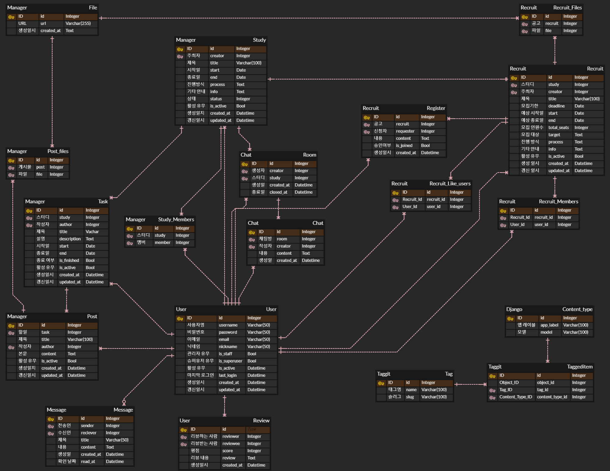
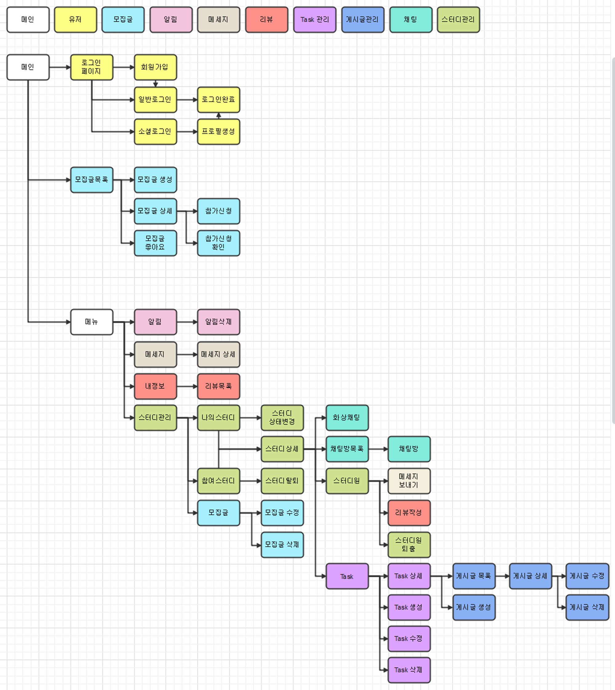

 
 

# 📒 프로젝트 개요

- 과거에 비해 오프라인 교육보다 이러닝 시장이 점차 확대되고 있으며, 특히 코로나19 이후 비대면 교육이 선택이 아닌 필수 교육 방식으로 대두되며 그 중요성은 더욱 커졌습니다.
- 초중고교를 대상으로 한 공교육, 사교육만 아니라 대학 교육, 취업을 위한 직무교육, 자기계발, 직무연수 등 다양한 분야에 있어서도 오프라인보다 온라인 채널을 이용하는 비중이 늘어나고 있음을 각종 통계를 통해 확인할 수 있었습니다.
- 교육에 있어서 이러한 변화는 교육과 부수되는 스터디 시장에도 영향을 미치게 되어 스터디 시장도 과거에 비해 지속적으로 성장하고 있습니다.
- 특히 시간과 장소의 제약을 받지 않는 온라인 스터디의 특성 상 다양한 분야에서 다양한 주제에 대해 목적에 부합하는 사람과 함께하고자 하는 니즈도 많아지고 있습니다.
- 이에 따라 스터디 모집과 관리도 온라인 환경을 통해 효율적으로 이루어져야 한다고 생각하였습니다.
- 이러한 이유로 단순히 공통 주제를 통한 스터디 모집에서 끝나는 것이 아니라 스터디 진행까지 할 수 있는 환경을 제공하여 하나의 플랫폼 내에서 스터디와 관련된 모든 것을 효율적으로 관리할 수 있는 웹 어플리케이션 StudyOn의 개발을 기획하였습니다.
- StudyOn을 통해 사용자는 스터디 모집 및 진행, 스터디 일정 계획, 게시글 작성과 자료 공유, 쪽지 및 텍스트/화상 채팅을 통한 커뮤니케이션, 스터디원의 리뷰 작성 및 이력 확인 등을 할 수 있습니다.

 
 
## 📆 진행 기간
- 2023.09.25 ~ 2023.10.23

 

## 🙋‍♂️ 팀원 및 역할 소개

### 🤴 문유빈 (팀장)
- NCP infra 설정 및 helm chart 작성
- WebRTC, coturn server로 화상채팅 구현
- Prometheus, Grafana로 모니터링 설정
- infra & backend & frontend

### 🧑 임정택

- backend & frontend

### 👦 이근한

- 스터디 관리 페이지 권한,상태변경 등 구현
- django-allauth를 이용한 소셜로그인 구현
- channels를 이용한 실시간알림 구현

### 👨 최선우

- CI/CD 구축
- channels, redis를 이용한 텍스트 채팅 구현
- celery, redis, flower를 이용한 비동기 스케줄링 구현
- celery, redis, flower 서버 설정을 위한 helm chart 작성
- NCloud Object Storage를 통한 파일 서버 구축? 파일 업로드/다운로드 구현?
- Task별 게시판 CRUD 구현 , 게시판 무한스크롤 구현
- infra & backend & frontend

 
 

# 💻 기술 및 환경

## 🖥️ Front-End

## 🖥 Back-End

## 🌎 Infra

## 🔍 Monitoring

 

## 📑 Installed Package

| Package                    | Required Ver. | Purpose                      |
|----------------------------|---------------|------------------------------|
| **`Django`**               | 4.2.5         | Web Framework                |
| **`django-taggit`**        | 4.0.0         | 태그 추가/생성/관리                  |
| **`gunicorn`**             | 21.2.0        | Web Server Gateway Interface |
| **`psycopg2-binary`**      | 2.9.7         | PostgreSQL 연결                |
| **`django-markdownx`**     | 4.0.2         | 마크다운 텍스트 지원                  |
| **`Pygments`**             | 2.16.1        | 문법 하이라이팅 및 코드 스타일링           |
| **`boto3`**                | 1.28.57       | AWS S3 서비스 아용                |
| **`django-storages`**      | 1.14.1        | 파일 스토리지 관리 (AWS S3)          |
| **`python-dotenv`**        | 1.0.0         | 환경 변수 관리 및 설정                |
| **`django-allauth`**       | 0.57.0        | 사용자 인증 및 계정 관리(Social Login) |
| **`channels[daphne]`**     | 4.0.0         | 실시간 웹 소켓 및 비동기 처리            |
| **`channels-redis`**       | 4.1.0         | Redis를 통한 Django 채널 관리       |
| **`django-redis`**         | 5.4.0         | Redis 데이터베이스 연동              |
| **`django-redisboard`**    | 8.4.0         | Django 애플리케이션의 Redis 모니터링    |
| **`uvicorn[standard]`**    | 0.23.2        | ASGI 서버 (예: 웹 소켓 지원)         |
| **`django-debug-toolbar`** | 4.2.0         | 디버깅 및 성능 모니터링 도구             |
| **`django-prometheus`**    | 2.3.1         | 모니터링 및 지표 수집                 |

 
 

# 🕍 Infra Structure

 

# 🗃️ ERD

 

# 🚩 Flowchart

 
 

# 🚀 프로젝트 목표 및 방향성

## 🏁 프로젝트 목표

### 1️⃣ 실제 ****사업 진행을 고려한 서비스 기획****

- 프로젝트 주제를 선정하기 전, 타겟 시장의 동향을 분석하고, 개발할 서비스의 차별점과 예상 효과를 평가하였습니다.

### 2️⃣ 빠른 개발 및 배포를 위해 Full Stack Framework로 Django를 사용

- Django Template Engine을 이용하여 Front-end를 구성하고, 동적 화면에 필요한 기능은 Vanilla JS를 사용하여 개발 작업의 속도를 높혔습니다.

### 3️⃣ 스프린트 단위로 작업을 진행

- 기본 기능 구현 / 심화 기능 구현 / 기능 점검 및 개선 의 총 3차로 스프린트를 구분하여 진행함으로써, 프로젝트를 더 쉽게 관리하고 작업의 효율을 높히고자 하였습니다.

### 4️⃣ 체계적인 문서 정리

- WBS 및 개인별 작업 일지를 꾸준히 작성함으로써 프로젝트 진행 현황을 파악하여 일정 및 역할 분담을 상황에 맞게 조정할 수 있었습니다.
- 단위별 작업을 마치면 반드시 Notion에 해당 작업과 관련된 내용을 정리하여 작업에 관한 아이디어 공유, 코드 리뷰 등을 진행하고자 노력하였습니다.

 

## 📚 프로젝트 관리

- **GitHub** : 코드 및 버전 관리, Projects 탭을 사용한 작업 관리 및 공유
- **Notion** : 전반적인 프로젝트 일정 계획 및 진행 현황 공유

 

## 👨‍🏫 프로젝트 진행

- 팀에서 정한 룰을 준수하여 일관성 있는 작업 진행을 목표로 하였습니다.

### 🏃‍♀️ 작업 진행 순서

1. `Issues` 탭에 이번 차수에 작업할 내용을 새로운 issue로 등록
    - `Assignees`, `Labels`, `Projects` 를 지정
2. 로컬 환경에서 코드 작업 진행
    - 최신 코드로 갱신된 `main` branch 로부터 작업을 위한 새로운 branch 를 생성하여 작업 진행
    - 하나의 커밋이 끝나면 수시로 push하여 현재 자신의 작업 진행 상황을 커밋 단위로 타인과 공유
3. `Pull Request` 를 통한 코드 병합
    - 코드 병합은 반드시 `Rebase and Merge` 방식으로 진행하여 충돌 발생 시, 쉽게 식별하고 해결할 수 있도록 관리
4. 코드 작업 완료 후, Notion에 카드를 생성하여 문서 작업 진행
    - 해당 차수의 작업에 관해 작업 방향, 방식, 코드 작성에 대한 설명을 문서로 정리

### 📈 Git Branch 전략

- **GitHub Flow**
    - 작업은 항상 개별 branch에서 진행하며, 하나의 커밋이 완료되면 원격 branch로 바로 push
    - 개별 branch에서 작업이 끝나면 Pull Request - Rebase and Merge 과정을 거쳐 짧은 주기로 빠르게 코드를 병합
    - 코드를 항상 최신 상태로 관리할 수 있는 간단하고 직관적인 워크플로우

### 📝 Commit Convention

- 작업 내용에 대한 이해를 높히고, 히스토리 추적을 용이하게 하기 위해 다음에 지정된 6가지의 타입을 Prefix로 지정하여 커밋 메세지를 작성

| Type | Description | Example |
| --- | --- | --- |
| **`Fix`** | 필수사항 수정 | Fix) Allowed Hosts에 localhost 추가 |
| **`Feat`** | 새로운 기능 추가 | Feat) s3 업로드 |
| **`Add`** | 기능 없이 파일만 추가 | Add) 로고 이미지 |
| **`Remove`** | 기능이나 파일 삭제 | Remove) 테스트용 이미지 |
| **`Update`** | 개선사항 수정 | Update) class -> func in study.view.detail |
| **`Docs`** | 문서 수정 | Docs) 메인 화면 이미지 in readme |

 
 

# 📺 프로젝트 주요 기능

## 1️⃣ 로그인 & 로그아웃 & 회원가입

- 사용자는 중복하지 않는 아이디, 이름과 비밀번호를 이용하여 계정을 생성하고 로그인/로그아웃 할 수 있습니다.

## 2️⃣ 스터디 모집

- 유저
    - 제목, 모집기간, 스터디 시작일/종료일, 태그, 파일 등을 추가해서 새로운 스터디 모집글을 생성할 수 있습니다.
    - 스터디 모집 목록 중 마음에 드는 모집글에 찜을 할 수 있습니다.
    - 모집글의 제목, 태그를 이용하여 검색할 수 있습니다.
- 팀장
    - 스터디 신청목록을 통해 팀원에 대한 리뷰를 확인하여 참가 확인/취소를 할 수 있습니다.
- 팀원
    - 팀원일 경우 스터디 참가신청을 할 수 있습니다.

## 3️⃣ 스터디 관리

- 로그인한 모든 유저
    - 만든 스터디와 참여한 스터디들을 볼 수 있습니다.
    - 참여한 스터디에서 탈퇴할 수 있습니다.
- 스터디 모든 멤버
    - Task를 생성하고 수정하며 완료 처리도 가능합니다
    - 각 Task에 대해 Post를 작성하고 파일을 추가할 수 있습니다. 또한 게시글과 파일 수정/삭제도 가능합니다.
    - 각 Task게시판에서 Post의 제목을 검색할 수 있습니다.
    - 첨부된 파일을 다운로드 할 수 있습니다.
    - 다른 스터디 멤버에 대한 리뷰를 남길 수 있습니다.
    - 화상채팅 기능을 사용할 수 있습니다.
        - 마이크와 카메라 on/off 설정할 수 있습니다.
    - 카테고리를 선택하여 각 스터디에 최대 3개 까지의 실시간 채팅방을 생성 할 수 있습니다.
    - 다른 멤버에게 메시지를 보낼 수 있습니다.
        - 메시지를 보낼 경우 실시간 알림이 뜨고 알림창에서 메시지내용과 보낸 사람을 확인할 수 있습니다.
        - 메시지를 확인하면 체크표시로 나타납니다.
- 팀장
    - 스터디에 대해 모집 중, 진행 중, 완료 등 스터디의 상태를 변경할 수 있습니다.
    - 스터디 멤버를 퇴출시킬 수 있습니다.
    - 스터디 상세페이지에서 스터디내용을 수정할 수 있습니다.
    - 채팅방 종료를 할 수 있습니다.

## 4️⃣ 알림

- 팀장이 사용자가 참가 신청한 모집글에 신청 확인을 하면 실시간 알림이 뜹니다.
- 멤버로 있는 스터디의 상태가 변경되면 실시간 알림이 뜹니다.

 

# 🧐 중점 고려사항

## ✅ Common

- **일관된 작업 스타일**: 작업 진행 순서를 준수하여 프로젝트 내에서 일관된 작업 스타일을 유지합니다.
- **일정 관리**: 잔여 일정을 관리하기 위해 각 단위별 작업에 대한 예상 소요 기간을 설정합니다.
- **코드 리뷰 및 아이디어 공유**: 정리된 문서를 통해 다른 팀원들과 코드 리뷰 및 아이디어 공유를 진행합니다.
- **모듈화**: 중복 코드를 모듈화하여 코드의 간결성을 추구합니다.

## ✅ Front-end

- **`화면 디자인 및 동적 컨텐츠`**: Django Template Engine과 Vanilla JS를 이용하여 화면 디자인 및 동적 컨텐츠를 구성합니다.
- **`화면 스타일`**: Tailwind CSS를 활용하여 일관된 화면 스타일을 지정하며 개발 속도를 향상시킵니다.
- **`화상 채팅`**: WebRTC를 활용하여 화상 채팅을 구현합니다.

## ✅ Back-end

- **`웹소켓 통신 및 비동기 작업`**: channels와 Redis를 활용하여 실시간 웹소켓 통신과 비동기 작업을 처리합니다.
- **`비동기 스케줄링`**: Celery와 Redis를 사용하여 비동기 스케줄링을 구현합니다.

## ✅ Infra

- **`IaC`**: Terraform을 사용하여 코드로 인프라를 관리하고 프로비저닝합니다.
- **`컨테이너 기반 배포`**: Docker, Kubernetes를 통해 애플리케이션을 컨테이너화 하여 배포하고 관리합니다.
- **`리소스 및 버전 관리`**: Helm Chart를 사용하여 애플리케이션 리소스 및 버전을 효과적으로 관리합니다.
- **`CI/CD 구축`**: GitHub Actions와 ArgoCD를 활용하여 지속적 통합 및 지속적 배포 환경을 구축합니다.

 
 

# 🔧 기술적 이슈 및 해결 과정

- 작성 예정

 
 

# 👨‍💻 설치 가이드

<strong>펼치기 / 접기</strong>

 
 

 

 

 

 

 

 
 

 
 
 

