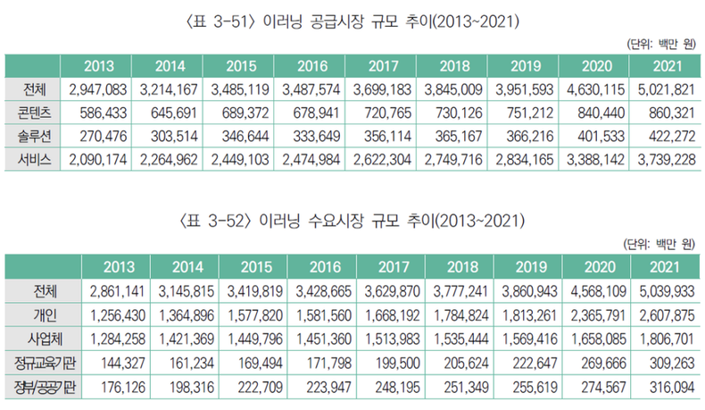
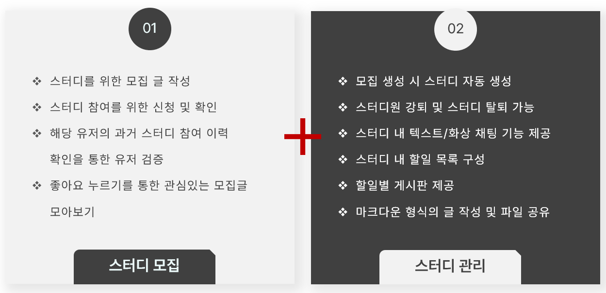
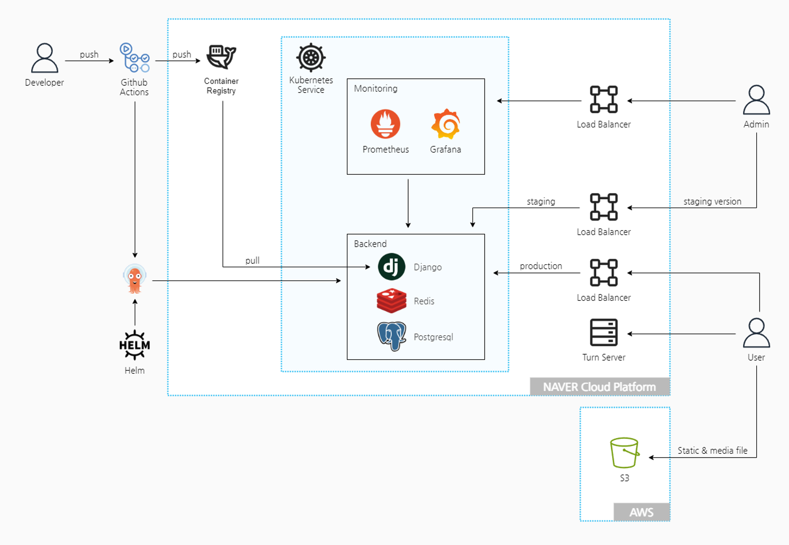
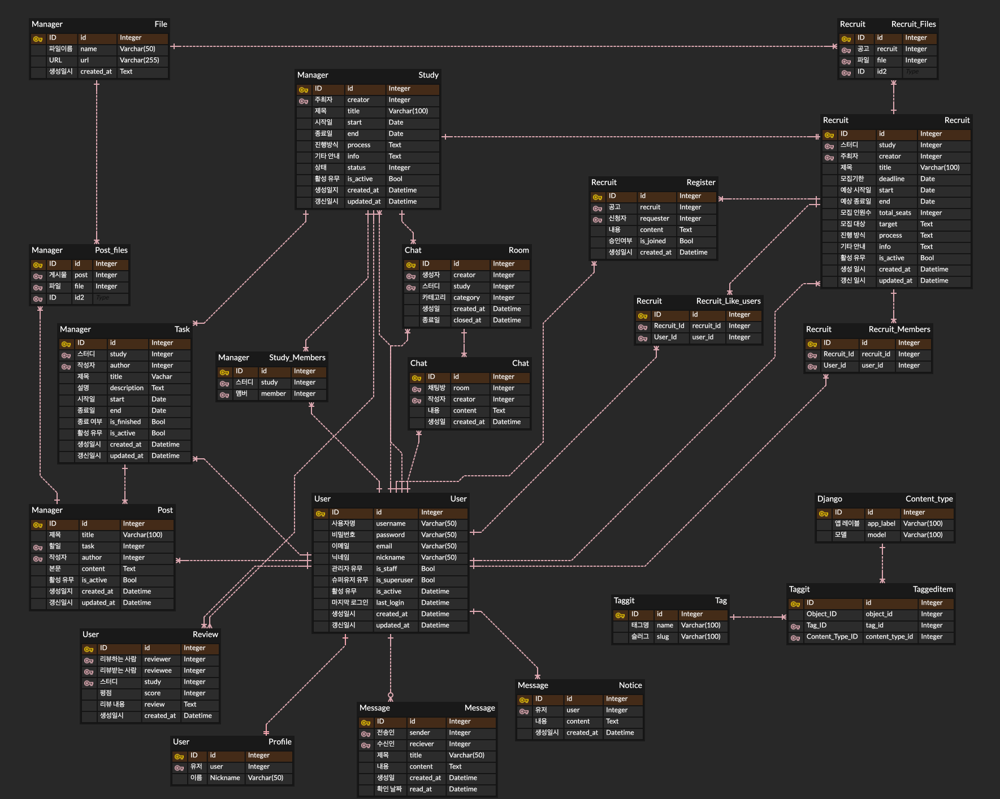
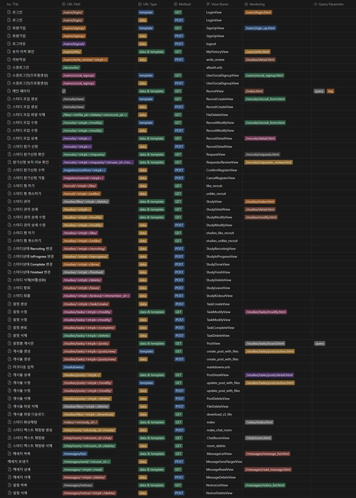
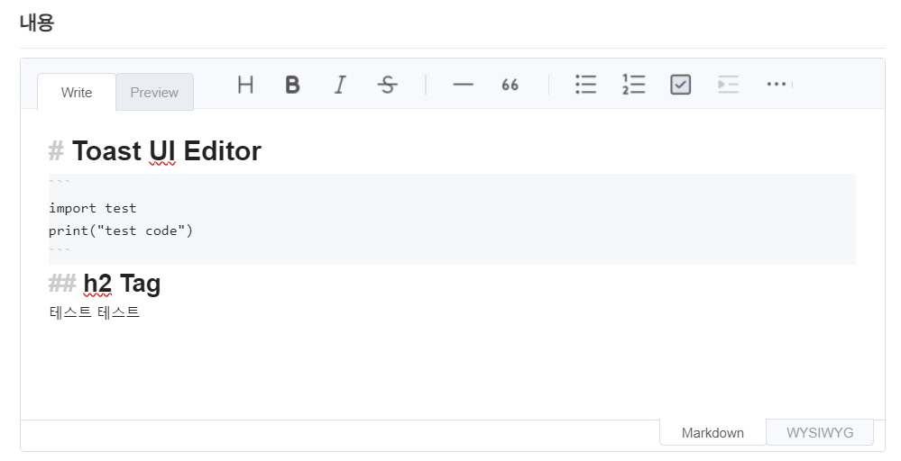
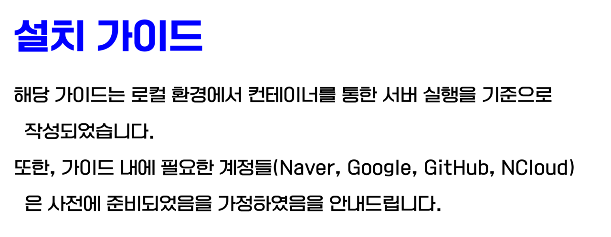
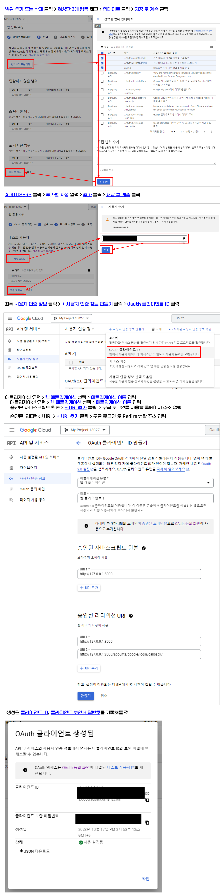
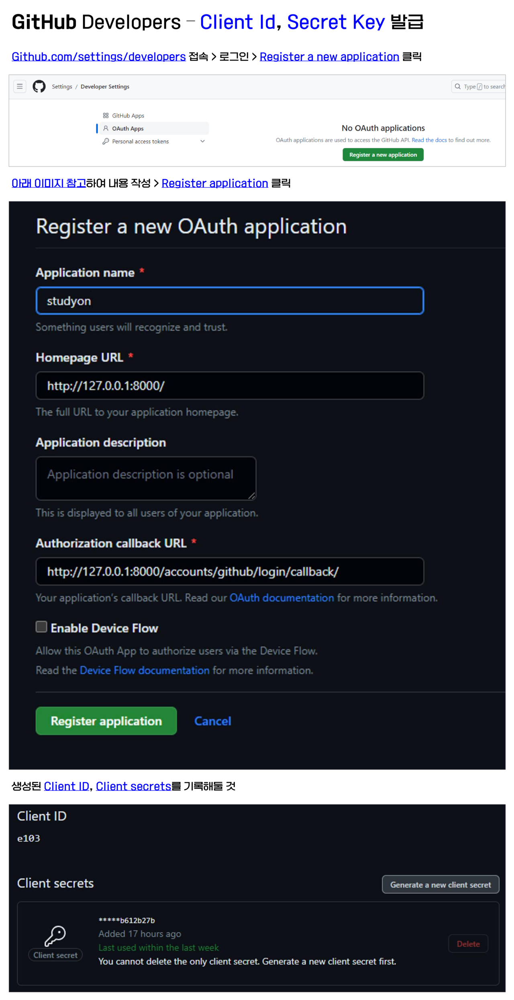

<br>
<br>


# 📒 프로젝트 개요


## 🌈 프로젝트 배경

- 이러닝 시장의 확대
- 코로나19 이후 비대면 교육의 비중 상승
- 교육 시장의 변화로 인해 그에 부수되는 스터디 시장도 과거에 비해 확대되고 있는 상황
- 시간과 장소의 제약을 받지 않는 온라인 스터디의 특성
- 다양한 분야에서 다양한 주제에 대해 목적에 부합하는 사람과 함께하고자 하는 니즈도 상승

| 이러닝 시장 규모 추이                                                                                     | 코로나19 이후 일상 활동 변화                                                                                                    |
| --------------------------------------------------------------------------------------------------------- | ------------------------------------------------------------------------------------------------------------------------------- |
| 출처 : [국내 e러닝 시장 '21년 5조원...연평균 7% 성장](https://m.dxtimes.co.kr/news/view/1065621431597379) | 출처: [[코로나가 바꾼 일상] (1) … 어온강에서 늘온강으로](https://www.mk.co.kr/economy/view.php?sc=50000001&year=2020&no=403111) |
|                                                          |                                                                                |

<br>


## 🏳‍🌈 프로젝트 기획


- 온라인 환경을 통한 효율적인 스터디 모집과 관리의 필요성
- 스터디 모집과 스터디 진행까지 하나의 플랫폼 내에서 관리할 수 있는 웹 어플리케이션 StudyOn의 개발을 기획
- StudyOn을 통해 스터디 모집 및 진행, 스터디 일정 계획, 게시글 작성과 자료 공유, 쪽지 및 텍스트/화상 채팅을 통한 커뮤니케이션, 스터디원의 리뷰 작성 및 이력 확인 등이 가능

| 서비스 기능 요약                        |
| --------------------------------------- |
|  |


<br>
 
## 📆 진행 기간

- 2023.09.25 ~ 2023.10.23

<br>

## 🙋‍♂️ 팀원 및 역할 소개

### 🤴 문유빈 (팀장)

- infra & backend & frontend
- NCP infra 설정 및 Helm chart 작성
- ArgoCD, Helm을 이용한 Kubernetes 환경으로의 배포
- WebRTC, Coturn server로 화상채팅 구현
- Prometheus, Grafana로 모니터링 설정
- 전체 화면 스타일링 점검 

### 🧑 임정택

- backend & frontend
- 메인페이지 검색 기능 구현
- 스터디 모집, 수정 기능 등 구현
- 로그인, 회원가입 유효성 기능 구현
- 스터디 이력 확인 구현

### 👦 이근한

- backend & frontend
- 스터디 관리 구현
- Django-Allauth를 이용한 소셜로그인 구현
- Channels, Redis를 이용한 실시간 알림 구현
- 유저간 메세지 송수신 기능 구현
- 내정보 확인 구현

### 👨 최선우

- infra & backend & frontend
- GitHub Actions를 이용한 CI/CD 구축
- Celery, Redis, Flower 서버 설정을 위한 Helm Chart 작성
- Channels, Redis를 이용한 텍스트 채팅 구현
- Celery, Redis, Flower를 이용한 비동기 스케줄링 구현
- NCloud Object Storage를 통한 파일 서버 구축
- Task별 게시판 CRUD 구현
- 게시판 무한스크롤, 채팅방 역무한스크롤 구현

### 🤝 공통

- 기획 및 설계
- 작업 단위 문서 작성 및 공유
- tailwindcss를 이용한 스타일링
- 로직 점검 및 수정
- 코드 및 스타일 개선

<br>
<br>

# 💻 기술 및 환경

## 🖥️ Front-End


## 🖥 Back-End


## 🌎 Infra


## 🔍 Monitoring


<br>

## 📑 Installed Package

| Package                     | Required Ver. | Purpose                                |
| --------------------------- | ------------- | -------------------------------------- |
| **`Python`**                | 3.11.0        | Programming Language                   |
| **`Django`**                | 4.2.5         | Web Framework                          |
| **`django-taggit`**         | 4.0.0         | 태그 추가/생성/관리                    |
| **`gunicorn`**              | 21.2.0        | Web Server Gateway Interface           |
| **`psycopg2-binary`**       | 2.9.7         | PostgreSQL 연결                        |
| **`django-markdownx`**      | 4.0.2         | 마크다운 텍스트 지원                   |
| **`Pygments`**              | 2.16.1        | 문법 하이라이팅 및 코드 스타일링       |
| **`boto3`**                 | 1.28.57       | AWS S3 서비스 아용                     |
| **`django-storages`**       | 1.14.1        | 파일 스토리지 관리 (AWS S3)            |
| **`python-dotenv`**         | 1.0.0         | 환경 변수 관리 및 설정                 |
| **`django-allauth`**        | 0.57.0        | 사용자 인증 및 계정 관리(Social Login) |
| **`channels[daphne]`**      | 4.0.0         | 실시간 웹 소켓 및 비동기 처리          |
| **`channels-redis`**        | 4.1.0         | Redis를 통한 Django 채널 관리          |
| **`django-redis`**          | 5.4.0         | Redis 데이터베이스 연동                |
| **`django-redisboard`**     | 8.4.0         | Django 애플리케이션의 Redis 모니터링   |
| **`uvicorn[standard]`**     | 0.23.2        | ASGI 서버 (예: 웹 소켓 지원)           |
| **`django-debug-toolbar`**  | 4.2.0         | 디버깅 및 성능 모니터링 도구           |
| **`django-prometheus`**     | 2.3.1         | 모니터링 및 지표 수집                  |
| **`celery`**                | 5.3.4         | 비동기 작업 큐 시스템                  |
| **`django-celery-beat`**    | 2.5.0         | 주기적인 작업 스케줄링                 |
| **`django-celery-results`** | 2.5.1         | Celery 작업 결과 저장                  |
| **`flower`**                | 2.0.1         | Celery 모니터링 도구                   |


<br>
<br>

# 🕍 Infra Structure

[repository](https://github.com/likelion-backend-6th/studyon-infra)



<br>

# 🗃️ ERD



<br>

# 🚩 Flowchart


<br>

# 🔖 URL Statement



<br>
<br>

# 🚀 프로젝트 목표 및 방향성


## 🏁 프로젝트 목표

### 1️⃣ 실제 ****사업 진행을 고려한 서비스 기획****

- 프로젝트 주제를 선정하기 전, 타겟 시장의 동향을 분석하고, 개발할 서비스의 차별점과 예상 효과를 평가하였습니다.

### 2️⃣ 빠른 개발 및 배포를 위해 Full Stack Framework로 Django를 사용

- Django Template Engine을 이용하여 Front-end를 구성하고, 동적 화면에 필요한 기능은 Vanilla JS를 사용하여 개발 작업의 속도를 높혔습니다.

### 3️⃣ 스프린트 단위로 작업을 진행

- 기본 기능 구현 / 심화 기능 구현 / 기능 점검 및 개선 의 총 3차로 스프린트를 구분하여 진행함으로써, 프로젝트를 더 쉽게 관리하고 작업의 효율을 높히고자 하였습니다.

### 4️⃣ 체계적인 문서 정리

- WBS 및 개인별 작업 일지를 꾸준히 작성함으로써 프로젝트 진행 현황을 파악하여 일정 및 역할 분담을 상황에 맞게 조정할 수 있었습니다.
- 단위별 작업을 마치면 반드시 Notion에 해당 작업과 관련된 내용을 정리하여 작업에 관한 아이디어 공유, 코드 리뷰 등을 진행하고자 노력하였습니다.

<br>

## 📚 프로젝트 관리

- **GitHub** : 코드 및 버전 관리, Projects 탭을 사용한 작업 관리 및 공유
- **Notion** : 전반적인 프로젝트 일정 계획 및 진행 현황 공유

<br>

## 👨‍🏫 프로젝트 진행

- 팀에서 정한 룰을 준수하여 일관성 있는 작업 진행을 목표로 하였습니다.

### 🏃‍♀️ 작업 진행 순서

1. `Issues` 탭에 이번 차수에 작업할 내용을 새로운 issue로 등록
    - `Assignees`, `Labels`, `Projects` 를 지정
2. 로컬 환경에서 코드 작업 진행
    - 최신 코드로 갱신된 `main` branch 로부터 작업을 위한 새로운 branch 를 생성하여 작업 진행
    - 하나의 커밋이 끝나면 수시로 push하여 현재 자신의 작업 진행 상황을 커밋 단위로 타인과 공유
3. `Pull Request` 를 통한 코드 병합
    - 코드 병합은 반드시 `Rebase and Merge` 방식으로 진행하여 충돌 발생 시, 쉽게 식별하고 해결할 수 있도록 관리
4. 코드 작업 완료 후, Notion에 카드를 생성하여 문서 작업 진행
    - 해당 차수의 작업에 관해 작업 방향, 방식, 코드 작성에 대한 설명을 문서로 정리

### 📈 Git Branch 전략

- **GitHub Flow**
    - 작업은 항상 개별 branch에서 진행하며, 하나의 커밋이 완료되면 원격 branch로 바로 push
    - 개별 branch에서 작업이 끝나면 Pull Request - Rebase and Merge 과정을 거쳐 짧은 주기로 빠르게 코드를 병합
    - 코드를 항상 최신 상태로 관리할 수 있는 간단하고 직관적인 워크플로우

### 📝 Commit Convention

- 작업 내용에 대한 이해를 높히고, 히스토리 추적을 용이하게 하기 위해 다음에 지정된 6가지의 타입을 Prefix로 지정하여 커밋 메세지를 작성

| Type         | Description           | Example                                    |
| ------------ | --------------------- | ------------------------------------------ |
| **`Fix`**    | 필수사항 수정         | Fix) Allowed Hosts에 localhost 추가        |
| **`Feat`**   | 새로운 기능 추가      | Feat) s3 업로드                            |
| **`Add`**    | 기능 없이 파일만 추가 | Add) 로고 이미지                           |
| **`Remove`** | 기능이나 파일 삭제    | Remove) 테스트용 이미지                    |
| **`Update`** | 개선사항 수정         | Update) class -> func in study.view.detail |
| **`Docs`**   | 문서 수정             | Docs) 메인 화면 이미지 in readme           |

<br>
<br>

# 📺 프로젝트 주요 기능

## 1️⃣ 유저

- 사용자는 중복되지 않는 ID로 회원가입을 할 수 있습니다.
- google, naver, github 을 이용해 소셜로그인을 할 수 있습니다.
- 다른 스터디원의 리뷰(평가)를 작성 할 수 있습니다.
- 자신이 받은 리뷰의 평균 점수를 볼 수 있습니다.
- 자신이 작성한 리뷰의 목록을 볼 수 있습니다.

## 2️⃣ 스터디 모집

- 유저
    - 제목, 모집기간, 스터디 시작일/종료일, 태그, 파일 등을 추가해서 새로운 스터디 모집글을 생성할 수 있습니다.
    - 스터디 모집 목록 중 마음에 드는 모집글을 찜 할 수 있습니다.
    - 모집글의 제목, 태그를 이용하여 검색할 수 있습니다.
    - 원하는 모집글에 참가신청을 할 수 있습니다.
- 팀장
    - 스터디 모집글의 신청목록을 통해 신청자에 대한 리뷰를 확인하여 참가 수락/거절를 할 수 있습니다.

## 3️⃣ 스터디 관리

- 로그인 유저
    - 생성한 스터디와 참여중인 스터디를 볼 수 있습니다.
    - 참여중인 스터디에서 탈퇴할 수 있습니다.
    - 자신이 생성한 모집글의 수정을 할 수 있습니다.
- 스터디 멤버
    - Task를 생성하고 수정하며 완료 처리도 가능합니다
    - 각 Task에 대해 Post를 작성하고 파일을 추가할 수 있습니다. 또한 게시글과 파일 수정/삭제도 가능합니다.
    - 각 Task게시판에서 Post의 제목을 검색할 수 있습니다.
    - 첨부된 파일을 다운로드 할 수 있습니다.
    - 스터디 멤버에 대한 리뷰를 남길 수 있습니다.
    - 화상채팅 기능을 사용할 수 있습니다.
        - 마이크와 카메라 on/off 설정할 수 있습니다.
    - 카테고리를 선택하여 각 스터디에 최대 3개 까지의 실시간 채팅방을 생성 할 수 있습니다.
    - 다른 멤버에게 메시지를 보낼 수 있습니다.
- 팀장
    - 스터디에 대해 모집 중, 진행 중, 완료 등 스터디의 상태를 변경할 수 있습니다.
    - 스터디 멤버를 퇴출시킬 수 있습니다.
    - 스터디 상세페이지에서 스터디내용을 수정할 수 있습니다.
    - 채팅방 종료를 할 수 있습니다.

## 4️⃣ 알림

- 다른 사용자가 자신의 모집글에 참가신청을 하면 알림이 뜹니다.
- 팀장이 사용자가 참가 신청한 모집글에 신청 확인을 하면 실시간 알림이 뜹니다.
- 멤버로 있는 스터디의 상태가 변경되면 실시간 알림이 뜹니다.
- 멤버로 있는 스터디의 스터디원이 탈퇴하면 알림이 뜹니다.
- 멤버로 있는 스터디의 채팅방의 입장,퇴장 알림이 뜹니다.
- 다른 사용자가 보낸 메세지가 있으면 알림이 뜹니다.

## 5️⃣ 메세지

- 받은 메세지에 답장,삭제 를 할 수 있다.
- 메세지를 확인하면 체크표시가 나타납니다.

<br>

# 🧐 중점 고려사항

## ✅ Common

- **`일관된 작업 스타일`**: 작업 진행 순서를 준수하여 프로젝트 내에서 일관된 작업 스타일을 유지합니다.
- **`일정 관리`**: 잔여 일정을 관리하기 위해 각 단위별 작업에 대한 예상 소요 기간을 설정합니다.
- **`코드 리뷰 및 아이디어 공유`**: 정리된 문서를 통해 다른 팀원들과 코드 리뷰 및 아이디어 공유를 진행합니다.
- **`모듈화`**: 중복 코드를 모듈화하여 코드의 간결성을 추구합니다.

## ✅ Front-end

- **`화면 디자인 및 동적 컨텐츠`**: Django Template Engine과 Vanilla JS를 이용하여 화면 디자인 및 동적 컨텐츠를 구성합니다.
- **`화면 스타일`**: Tailwind CSS를 활용하여 일관된 화면 스타일을 지정하며 개발 속도를 향상시킵니다.
- **`화상 채팅`**: WebRTC를 활용하여 화상 채팅을 구현합니다.

## ✅ Back-end

- **`웹소켓 통신 및 비동기 작업`**: channels와 Redis를 활용하여 실시간 웹소켓 통신과 비동기 작업을 처리합니다.
- **`비동기 스케줄링`**: Celery와 Redis를 사용하여 비동기 스케줄링을 구현합니다.

## ✅ Infra

- **`IaC`**: Terraform을 사용하여 코드로 인프라를 관리하고 프로비저닝합니다.
- **`컨테이너 기반 배포`**: Docker, Kubernetes를 통해 애플리케이션을 컨테이너화 하여 배포하고 관리합니다.
- **`리소스 및 버전 관리`**: Helm Chart를 사용하여 애플리케이션 리소스 및 버전을 효과적으로 관리합니다.
- **`CI/CD 구축`**: GitHub Actions와 ArgoCD를 활용하여 지속적 통합 및 지속적 배포 환경을 구축합니다.

<br>
<br>

# 🔧 기술적 이슈 및 해결 과정

## 새로운 알림 및 메세지 유무 표시

- 확인 후 삭제하지 않은 알림이나 새로운 수신 메세지가 있을 경우 네비게이션 탭에서 빨간색 점으로 표시하기 위해 모든 페이지에서 표시가 되어야 한다.
    
    - `message/context_processor.py`
    ```python
    from .models import Message, Notice


    def get_recent_message(request):
        if request.user.is_authenticated:
            recent_message = Message.objects.filter(reciever=request.user).first()
            return {"recent_message": recent_message}
        else:
            recent_message = None
            return {"recent_message": recent_message}


    def get_recent_notice(request):
        if request.user.is_authenticated:
            recent_notice = Notice.objects.filter(user=request.user).first()
            return {"recent_notice": recent_notice}
        else:
            recent_notice = None
            return {"recent_notice": recent_notice}
    ```

    - `config/settings/base.py`
    ```python
    TEMPLATES = [
        {
            "BACKEND": "django.template.backends.django.DjangoTemplates",
            "DIRS": [os.path.join(BASE_DIR, "templates")],
            "APP_DIRS": True,
            "OPTIONS": {
                "context_processors": [
                    "django.template.context_processors.debug",
                    "django.template.context_processors.request",
                    "django.contrib.auth.context_processors.auth",
                    "django.contrib.messages.context_processors.messages",
                    "django.template.context_processors.request",
                    "message.context_processors.get_recent_message",
                    "message.context_processors.get_recent_notice",
                ],
            },
        },
    ]
    ```
- 모든 페이지에 적용시키기 위해 `base.html`에 표시되도록 작성
- 모든 페이지에서 사용해야 하기 때문에 전역변수로 설정해서 객체 호출


## 비밀 번호 검증 기능
  - 회원 가입폼을 따로 만들어서 회원 가입을 하기 때문에 비밀번호를 검증하는 기능이 필요했다.
    - `user/forms.py`
    ```python
    class SignupForm(models.ModelForm):
            # .. 생략 ..
            
            def clean_password_check(self):
            cleaned_data = super().clean()
            password = cleaned_data.get("password")
            password_check = cleaned_data.get("password_check")

            if password != password_check:
                raise forms.ValidationError("비밀번호와 비밀번호 확인이 같지않습니다.")

            validate_password(password)

            return password_check
    ```
    - Django의 비밀번호 검증 기능을 하는 validate_password()메서드를 사용하여 강력한 비밀번호를 만들게 했습니다.


## NCloud Object Storage를 통한 파일 서버 구축
  - 게시판에 글 작성 시, 첨부 파일을 Object Storage의 지정된 버킷에 업로드하도록 구현
  - 게시글 확인 페이지 템플릿에서 `a` 태그 내에 `download` 속성을 추가하여 작성된 게시글 내에서 첨부 파일명 클릭 시 파일이 다운로드될 것으로 기대함
    ```html
        <!-- .. 생략 .. -->
            
                <div class="w-4/5 xl:w-5/6 lg:w-11/12 file-wrap">
                    <div class="mt-5 text-2xl font-bold title">첨부파일</div>
                    <hr class="my-2">
                    <div class="flex flex-col mb-20 content sm:flex-row">
                        
                            <a href=""
                            class="my-1 mr-4 text-xs underline text-real-blue hover:font-bold"
                            title="파일 다운로드"
                            download>{{ file.get_file_name }}</a>  <!-- download 속성 추가 -->
                        
                    </div>
                </div>
            
        <!-- .. 생략 .. -->
    ```
    - 그러나, 파일명 클릭 시, 파일이 브라우저 내에서 로드될 뿐, 다운로드되지 않는 현상 발생
- boto3 공식 문서를 통해 `get_object` 메서드를 이용하면 bucket에 저장된 파일의 내용을 가져올 수 있음을 확인
- 파일을 현재 서버로 로드하여 `HttpResponse`로 `return`하는 파일 다운로드 기능을 구현을 진행
    ```python
        def s3_file_download(file_id):

            # .. 생략 ..

            s3_file_object = s3.get_object(Bucket=bucket_name, Key=file_key)
            file_body = s3_file_object.get("Body")
            content_type = s3_file_object.get("ContentType")

            response = HttpResponse(file_body, content_type=content_type)

            encoded_filename = quote(file.name)
            response[
                "Content-Disposition"
            ] = f'attachment; filename="{encoded_filename}.{file.url.split(".")[-1]}"'

            return response
    ```


## Markdown 스타일 문제
  - 게시글 입력시 markdown입력을 지원
  - TailwindCSS에서 기본 tag 스타일을 기본 텍스트로 변경해 markdown이 제대로 표시되지 않음
  - css에서 기본 tag에 스타일을 넣어주려 하였으나 강사님 조언으로 외부 툴 활용
  - Toast UI Editor를 추가해 markdown입력과 preview를 추가하였고 스타일도 넣어줄 수 있었음
    


<br>
<br>

# 👨‍💻 설치 가이드

<details>
<summary><strong>펼치기 / 접기</strong></summary>
<div markdown="1">

<br>
<br>



<br>


<br>




<br>



<br>


<br>


<br>
<br>

</div>
</details>

<br>
<br>
<br>


