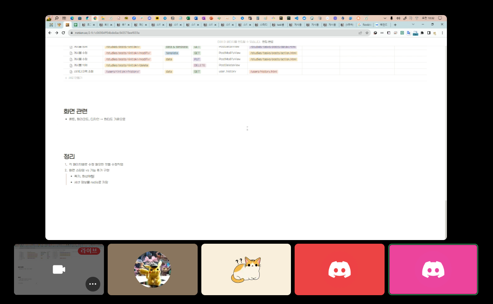

# [1주차] Project_2팀 진행상황 공유

## 팀 구성원, 개인 별 역할

### 강경민

### 문유빈

- 인프라
    - NCP kubernetes 생성 terraform
    - 배포용 helm chart
    - argoCD staging, prod
    - DNS 연결
- 유저관리
    - 로그인
    - 회원가입
    - 유저 리뷰
- 기초 디자인
    - 메인페이지
    - 로그인
    - 회원가입
    - 모집 상세
    - 스터디 관리
    - 스터디 관리 상세

### 임정택

- 메인 페이지
    - 스터디 모집 목록, 참여중인 스터디 목록, 자신이 찜한 스터디 목록
    - 모집글 찜하기 버튼, 스터디 생성 버튼
    - title, tag 검색 기능
- 모집 상세 페이지
    - 모집 상세 내용
    - 팀원일 경우 신청폼 출력 팀장일 경우 신청 확인 페이지로 이동
- 모집 신청 확인 페이지
    - 신청자 목록 출력
    - 신청 확인, 취소 버튼
- 모집글 생성, 수정
    - 모집글 생성시 스터디도 같이 생성

### 이근한

스터디관리 페이지 기능 구현

- 스터디 관리 메인 페이지
    - 자신의 모집글, 좋아요누른 모집글, 자신의 스터디, 자신이 속한 스터디 목록 출력
- 스터디 관리 상세 페이지
    - 자신의 스터디
        - 스터디 정보 출력
        - 스터디 정보 수정 기능
        - 스터디원 퇴출 기능
        - 스터디 상태 변경 기능
        - Task 추가 기능
        - Task 수정 기능
        - Task 상태 변경 기능
    - 자신이 속한 스터디
        - 스터디 정보 출력
        - 스터디 탈퇴 기능
        - Task 추가 기능
        - Task 수정 기능
        - Task 상태 변경 기능

### 최선우

- 인프라
    - CI/CD 워크플로우 구현
- 스터디 관리 - Task별 게시판 CRUD 구현
- 파일 업로드 기능 구현
- AWS S3 를 통한 정적 파일 서빙

## 팀 내부 회의 진행 회차 및 일자

| 일자        | 시각          | 참여 인원                      | 진행 방법          |
| ----------- | ------------- | ------------------------------ | ------------------ |
| 2023. 9. 27 | 09:00 ~ 11:00 | 전원                           | 디스코드 화상 회의 |
| 2023. 10. 1 | 11:00 ~ 12:00 | 문유빈, 이근한, 최선우         | 디스코드 화상 회의 |
| 2023. 10. 4 | 09:00 ~ 12:00 | 문유빈, 임정택, 이근한, 최선우 | 디스코드 화상 회의 |

## 현재까지 개발 과정 요약 (최소 500자 이상)

### 인프라

- **최선우**
    - CI/CD
        - GitHub Runner 환경에서의 테스트 실행 : 100%
        - Latest Ver, Tag Name Ver. 이미지 생성 및 push : 100%
        - Infra Repository의 appVersion 수정을 통해 ArgoCD에서의 배포 자동화 : 100%
- **문유빈**
    - NCP kubernetes terraform 작성 및 실행 : 100%
    - 배포에 필요한 helm chart 작성 : 100%
    - argoCD를 통해 staging, prod 버전 배포 후 outofsync 해결 : 100%
    - staging, prod를 배포하며 생성된 LB를 DNS에 연결 : 100%
    - github 이벤트를 discord 알림으로 받을 수 있도록 설정

### 유저 관리

- **문유빈**
    - 로그인, 회원가입 기능과 여러 상황에 대한 테스트 코드 작성 : 100%
    - 로그인, 회원가입 페이지 스타일 적용 : 100%
    - 로그인, 회원가입 에러 메시지 표시 필요
    - 유저 리뷰 기록 : 80% - 스타일 적용 필

### 스터디 모집

- **임정택**
    - title, tag 검색 기능/ 달성률: 80% title, target, info등 검색 요소 수정사항
    - 찜하기 기능/ 달성률: 100%
    - 모집글 생성/ 달성률: 70% 파일 업로드 수정사항, 날짜 필드 수정사항
    - 모집글 생성,수정 시 모집기간 유효성 검사/ 달성률: 100%
    - 스터디 신청 확인, 취소 기능/ 달성률: 100%

### 스터디 관리

- **이근한**
    - 스터디 정보 수정 기능 / 달성률 : 80% - 내용 수정 가능 ( 스터디 정보 수정 권한 및 날짜 유효성 검사 추가 예정 )
    - 스터디원 퇴출 기능 / 달성률 : 80% - 자신이 생성한 스터디에서 스터디원 퇴출 가능 ( 스터디 퇴출 권한 추가 예정)
    - 스터디 상태 변경 기능 / 달성률 : 80% - 자신이 생성한 스터디의 상태 변경 가능 ( 자신이 생성한 스터디 한해서 가능하게 권한 추가 예정)
    - 스터디 탈퇴 기능 / 달성률 : 80% - 자신이 속한 스터디 탈퇴 가능 ( 스터디 멤버에 속해 있어야지 탈퇴 가능하게 권한 추가 예정)
    - Task 추가, 수정 기능 / 달성률 : 80% - 자신이 속한 스터디에 Task 추가 가능 ( 스터디 멤버에 속해 있어야지 추가 가능하고 스터디장 또는 자신이 생성한 Task에 한해 수정 가능하게 권한 추가 예정)
    - Task 상태 변경 기능 / 달성률 : 80% - 자신이 속한 스터디 에서 생성한 Task 상태 변경 가능 ( 스터디 멤버에 속해 있어야 하며, 스터디장 또는 자신이 생성한 Task에 한해 상태 변경 가능하게 권한 추가 예정)
    - 아쉬운점
        - 권한 설정
        - 코드가 깔끔하지 않다?
    - 시도해볼 점
        - 권한 설정
        - 채팅방 개설
- **최선우**
    - AWS S3를 이용한 정적 파일 서빙 : 100%
        - 현재 NCP를 활용중이니, 정적 파일 서빙도 AWS S3가 아닌, Object Storage로 연결할 수 있으면 좋을 것 같음
        - 이전 트랙 프로젝트 시 시도해보았으나, 결국 방법을 찾지 못한 선례가 있음.
    - 스터디 관리 - Task별 게시판 CRUD 구현
        - 게시판 조회 : 100%
        - 게시글 작성 : 90%
            - Javascript를 이용하여 파일 첨부 개수를 늘리거나 줄이는 부분이 어려웠습니다.
            - `+` 버튼 클릭 시, 제대로 동작하지 않는 부분에 대한 수정이 필요
        - 게시글 수정 : 90%
            - `+` 버튼 클릭 시, 제대로 동작하지 않는 부분에 대한 수정이 필요
        - 게시글 삭제 : 100%
    - 파일 업로드 기능 구현 : 100%
    - **추가 개선 사항**
        - 코드 스타일을 팀원과 맞추고, 전체적으로 타입힌팅을 추가하여 가독성을 높이면 좋을 것으로 판단됨
        - 테스트 케이스를 미리 작성 후 코드 작업을 하여 다양한 경우에 대한 테스트를 진행할 필요가 있을 것으로 판단됨

## 개발 과정에서 나왔던 질문 (최소 200자 이상)

- Django 기본 유저 인증 템플릿을 사용하지 않는 상황에서 LoginRequired 관련 permission 클래스/함수 사용 시, redirect되는 login url 지정하는 방법
    - 설정 파일에서 `LOGIN_URL`을 지정하면 됨
- Django Form 에서 forms.DateInput을 사용해 날짜를 입력받는 방법
- A. <lable><input type="date" id="{}"></label>을 이용하면 편하게 입력 받으 실 수 있습니다.
- 한 번에 여러 개의 form을 입력받을 때 어떤 식으로 구현할 수 있는가?
    - Django formset을 이용하면 됨.
- Django에서 Nested RelationShip 관계를 갖는 두 개의 모델을 한 꺼번에 입력 처리 받는 방법?
    - inline-formset을 이용하면 됨
    - 그러나 새로운 field를 추가해야 하는 상황에서의 사용 방법을 구현해보고자 하였으나 실패하여 일반 formset을 사용하여 구현
        - File 모델의 경우, file 객체를 업로드 받아 url을 db에 저장해야 하는 상황에서 inline-formset을 사용하여 구현하려고 하였으나 실패함
    - A. 모델이 분리되어 있는 경우는 프론트에서 데이터를 한 번에 받고 내부 함수에서는 별도로 처리해주는 것이 조금 더 유지보수에 좋습니다.
- ArgoCD에서 NCP 연결 시 OutofSync로 지속적인 sync 시도 문제
    - cilium identity 리소스가 임의로 생겨 발생하는 문제이므로 cilium identity 를 ignore 해주어 해결하였음.

## 개발 결과물 공유

**Github Repository URL:** 

- [**https://github.com/likelion-backend-6th/studyon-infra**](https://github.com/likelion-backend-6th/studyon-infra)
- [**https://github.com/likelion-backend-6th/studyon**](https://github.com/likelion-backend-6th/studyon)

