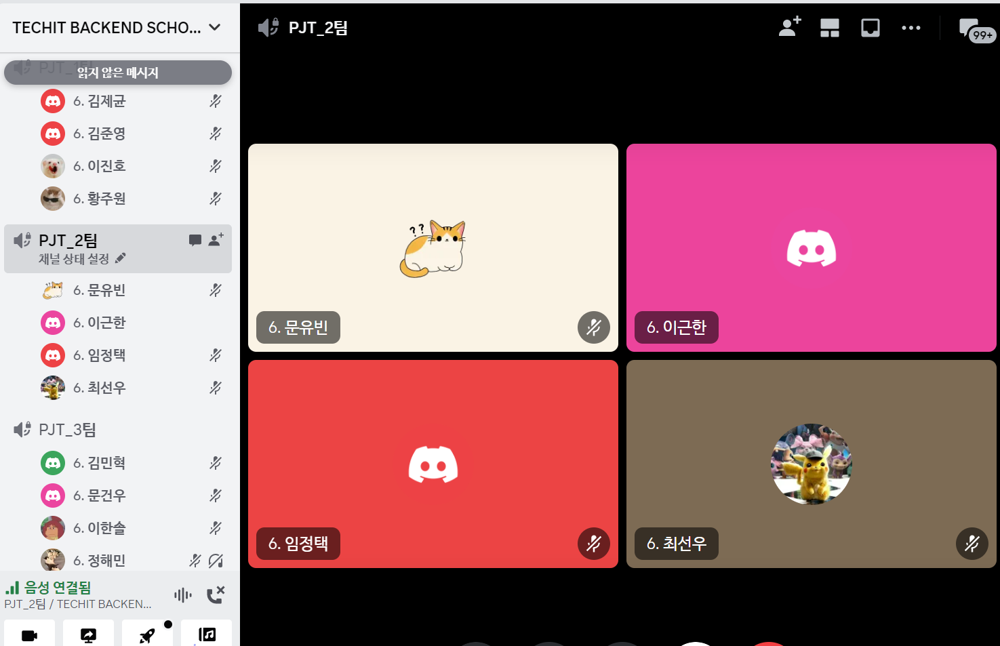

# [2주차] Project_2팀 진행상황 공유

## 팀 구성원, 개인 별 역할

### 문유빈

태그 기능 추가

- 백엔드 태그 제한 로직 추가
- 프론트 태그 선택 로직 작성

각종 페이지 디자인 업데이트

docker에 css build 추가

전체 템플릿 djlint reformat

djLint formatting 강제

화상채팅 기능 구현

- webRTC 공부
- ICE, SDP exchange 구현
- 로컬에서 동작하는 webRTC 구현
- stun,turn server 테스트
- coturn setting

tls로 https 적용

- openssl 인증서 발급
- NCP에 openssl 인증서 등록
- kubernetes service에 인증서 연결

### 임정택

모집 생성

- 날짜 잘못 입력 했을 시 에러 메시지 출력

채팅

- 각 스터디 마다 태그를 이용해 3개까지 채팅방을 만들어 채팅 기능
- 채팅 내역 DB에 저장

### 이근한

스터디 관리 페이지 권한 추가

실시간 알림 기능

- 스터디 상태 변경 알림
- 스터디 탈퇴 알림

메세지 주고받기 기능

- 다른 유저와 메세지 주고받기
- 메세지 전송 알림

### 최선우

File Upload 기능

- 로직 개선

게시판

- 게시글 생성/수정 화면 에러 수정
- 페이지네이션, 무한스크롤 구현
- Toast UI 에디터 적용

화면 스타일

- tailwind css를 이용한 스타일 개선
- date picker 적용

추가 개발

- 일정 산출 및 역할 분담
- 테이블 정의서 및 ERD 업데이트
- cache, websocket, channels 학습

텍스트 채팅

- 기능 구현
- 채팅 저장 구현

인프라

- django 서버 repository에 redis 설정
- infra repository에 redis 매니페스트 파일 작성

## 팀 내부 회의 진행 회차 및 일자

| 일자         | 회차 | 시각          | 참여 인원                      | 진행 방법          |
| ------------ | ---- | ------------- | ------------------------------ | ------------------ |
| 2023. 10. 6  | 04   | 16:30 ~ 18:30 | 문유빈, 임정택, 이근한, 최선우 | 디스코드 화상 회의 |
| 2023. 10. 7  | 05   | 10:30 ~ 12:00 | 임정택, 이근한, 최선우         | 디스코드 화상 회의 |
| 2023. 10. 17 | 06   | 09:00 ~ 12:00 | 문유빈, 임정택, 이근한, 최선우 | 디스코드 화상 회의 |

## 현재까지 개발 과정 요약 (최소 500자 이상)

### 스터디관리

- 이근한
    - 스터디 관리 권한 추가 / 달성률 : 100% - 권한을 가진 유저만 스터디 관리 가능
- 최선우
    - 게시판 기능 - 무한스크롤 구현 및 Toast UI 에디터 적용 / 달성률 : 100%

### 실시간 알림

- 이근한
    - 실시간 알림 기능 추가 / 달성률 : 80% - 실시간 알림 기능 추가 ( 알림내용 추가 예정, 디자인 추가 예정)
    - 실시간알림
        1. 스터디 상태 변경 알림
        2. 메세지 전송 알림

### 메세지 주고받기

- 이근한
    - 메세지 주고받기 기능 추가 / 달성률 : 90% - 스터디원과 메세지 주고받기 가능 ( 디자인 추가 예정)

### 텍스트 채팅

- 임정택
    - 기본 채팅 기능 구현 : 100%
    - 채팅방에 태그 저장 기능 추가 : 90%
- 최선우
    - 웹소켓 생성 및 채널 레이어 연결
    - 채팅 저장 / : 100% - 추후 DB가 아닌 csv 파일 저장으로 개선 예정

### 화상채팅

- 문유빈
    - webRTC이해 / 달성률 : 60% - 적당히 구현할 정도로는 이해한듯
    - 로컬에서 화상채팅 구현 / 달성률 : 100% - 로컬 및 공인ip 환경에서는 정상적으로 동작함
    - ice, sdp exchange 기능 / 달성률 : 100% - Django channel을 통해 데이터 교환
    - turn server 설정 / 달성률 : 60% - 서버는 준비했지만 자잘한 버그가 많음

### 인프라

- 문유빈
    - https 환경 준비 / 달성률 : 100% - prod, staging은 tls 적용 완료
    - coturn server 준비 / 달성률 : 50 - 수동으로 인스턴스를 생성해 실행만 시켜둠

## 개발 과정에서 나왔던 질문 (최소 200자 이상)

### Redis 서버 운영 관련

- 캐시와 채널레이어를 위한 Redis 서버를 별도로 운영해야 하는지?
    - 하나의 서버 내에서 데이터베이스 번호를 달리하여 사용하면 됨

### Gunicorn을 asgi 앱으로 실행 시 설정하는 코드 및 오류 관련

- 왜 gunicorn 설정 파일에서 `django.setup()` 을 다시 진행해야 하고, `DJANGO_SETTINGS_MODULE` 을 다시 로드해야 하는지?
    - wsgi 워커와 asgi워커를 동시에 구동하는 방식으로 변경하면 될 것으로 판단된다는 조언을 받았으나, Django를 해당 방식으로 구동하는 방식에 대해 찾지 못함
- `ASGI 'lifespan' protocol appears unsupported.` 경고 메세지에 대한 해결 방법

### WebRTC 구현 과정에서 stun및 turn 서버 사용 시 발생하는 지연 현상 해결

- 오픈소스 turn server인 coturn을 통해 직접 turn service를 호스팅 하여 해결해볼 예정

### 알림 내용 유지

- 알림 생성으로 인해 페이지가 새로고침되어 알림이 사라지는 현상을 방지하는 방법
    - 아래 2가지 방법 중 택1
        - Backend에서 처리 : `message` 프레임워크를 사용한 구현
        - Frontend에서 처리 : `Fetch` 함수를 이용한 비동기 방식으로 구현

## 개발 결과물 공유

**Github Repository URL:** 

- [**https://github.com/likelion-backend-6th/studyon-infra**](https://github.com/likelion-backend-6th/studyon-infra)
- [**https://github.com/likelion-backend-6th/studyon**](https://github.com/likelion-backend-6th/studyon)

