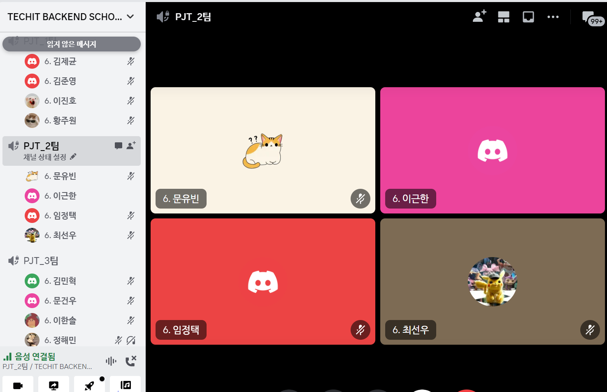

# [3주차] Project_2팀 진행상황 공유

# 팀 구성원, 개인 별 역할

## 문유빈

- 화상채팅
    - 스터디에 화상채팅 연결
    - 화상채팅 추가 기능 구현
- 모니터링
    - prometheus 추가
    - grafana 추가
    - grafana staging, prod 환경 출력 분리

## 임정택

- 회원가입, 로그인 페이지
    - 잘못된 정보로 회원가입/로그인 시 에러 메시지 출력
- 메인 페이지
    - 무한 스크롤 수정
    - 모집글 필터 수정
- Readme
    - 프로젝트 주요기능 작성

## 이근한

- 실시간알림
    - 디자인추가
    - 알림내용추가
        1. 채팅방 입장,퇴장 알림
        2. 모집신청 알림
        3. 모집신청 결과 알림
- 메세지
    - 디자인 추가
- 소셜로그인
    - 중복 가입 방지 페이지 디자인추가
- README
    - workflow 작성

## 최선우

- 텍스트 채팅
    - 웹소켓 재연결 기능 구현
    - 카테고리를 이용한 채팅방 생성 구현
    - 웹소켓 모듈화
    - 채팅방 종료 기능 추가
- 비동기 스케줄링
    - celery, redis를 이용한 비동기 작업 설정
    - celery-beat를 이용한 비동기 스케줄링 추가
- infra
    - 컨테이너 환경에서의 celery 관련 서비스 추가
    - helm chart에 celery 관련 리소스 매니페스트 파일 추가
- README
    - 목차 작성 및 역할 분담
    - 배포 가이드 작성
    - 프로젝트 개요 작성

# 팀 내부 회의 진행 회차 및 일자

| 일자         | 회차 | 시작 시각 | 종료 시각 | 참여 인원                      | 진행 방법          |
| ------------ | ---- | --------- | --------- | ------------------------------ | ------------------ |
| 2023. 10. 12 | 07   | 09:00     | 12:00     | 문유빈, 임정택, 이근한, 최선우 | 디스코드 화상 회의 |
| 2023. 10. 13 | 08   | 09:00     | 11:00     | 문유빈, 임정택, 이근한, 최선우 | 디스코드 화상 회의 |
| 2023. 10. 16 | 09   | 09:00     | 11:00     | 문유빈, 임정택, 이근한, 최선우 | 디스코드 화상 회의 |

# 현재까지 개발 과정 요약 (최소 500자 이상)

## 화상채팅

- 문유빈
    - 스터디 관리에 화상채팅 구현 / 달성률 : 100% - 사소한 부분에서 미흡함이 보이지만 핵심 기능은 모두 구현하였으니 이정도면 괜찮다고 생각한다.

## 모니터링

- 문유빈
    - prometheus / 달성률 : 100% - django와 server 모두 설정을 마쳐 데이터를 가져오는 부분은 문제 없이 준비하였다.
    - grafana / 달성률 : 70% - prometheus와 연결하고 target에 따라 확인할 수 있도록 나눠 놨지만 아직 알림 기능과 표시할 데이터를 수정 해야한다.
    
## 텍스트 채팅

- 달성률 : 90%
    - 최선우
        - 기획 당시 생각하였던 필수 기능 구현은 완료한 것으로 판단됨
            - 카테고리를 이용한 채팅방 생성
            - 채팅방 입장/종료 시 웹소켓 연결/종료
            - 채팅방 입장 시 기존 채팅 내역 로드
            - 웹소켓 비정상 종료 시, 자동 재연결 시도
            - 채팅 메시지 입력 시 나/타인별 메세지 스타일 지정
            - 스터디 팀장이 채팅방 종료 시 모든 팀원 강제 퇴장
    - 이근한
        - 채팅방 입장 시, 알림 메시지 전송
    - 구현하지 않기로 결정한 기능들
        - 채팅방 내 현재 참여 인원 표시
        - 채팅방 입장/퇴장 시, 채팅창 화면에 접속/퇴장 메시지 띄우기
    - 구현 예정 기능
        - 역무한스크롤

## 실시간알림

- 이근한
    - 실시간알림 디자인추가 및 내용추가 / 달성률 : 90% - 채팅방 퇴장시 알림 수정 필요

## 메세지

- 이근한
    - 메세지 디자인 추가 / 달성률 : 100%

## 소셜로그인

- 이근한
    - 중복가입 방지 페이지 디자인 추가 / 달성률 : 100% - 같은 이메일로 소셜로그인 시 연결되는 페이지를 모달창을 띄워 로그인화면으로 리디렉션

# 개발 과정에서 나왔던 질문 (최소 200자 이상)

## grafana에서 prometheus의 target을 분리해 표시할 방법

grafana 기본 django 대시보드에서는 prometheus의 target별로 데이터를 확인할 방법이 보이지 않았다.

- target을 분리하기 위해 `job` label을 가진 value를 만들어서 target값을 가지게 하고 데이터를 가져오는 query에서 job을 필터링에 넣어줌으로써 수정할 수 있었다.

## Celery beat scheduler를 db를 이용할 시, 간헐적으로 실행되지 않는 문제

- 배정만 강사님 답변 : celery를 debug 레벨로 실행하여 체크해볼 것

## helm chart로 배포 시, django 관련 staging 서버에서 channels_redis에서 발생하는 에러

- staging 서버 셋팅 파일이 잘못되어 발생했던 문제로 확인됨

## README 목차 및 구성 관련

### 목차

- 너무 과하게 작성하지 말고, 일목요연하게 정리하여 가독성이 좋게 할 것

### 구성

- infra structure의 경우, 너무 심플하면 프로젝트 구조 파악이 어렵고 너무 과하면 가독성이 나쁘므로 현재 작성된 수준을 유지할 것
- 프로젝트 목표 및 방향성은 프로젝트 진행에 대해 개인과 팀의 성향을 파악할 수 있는 부분이므로 잘 작성할 것을 추천
- 설치 가이드는 docker-compose 환경은 반드시 작성할 것.
    - k8s는 강사님 두분의 의견이 갈려서 팀 내부 회의를 거쳐 가이드 작성하지 않는 것으로 결정

## JS에서 django context를 가져와 사용하는 방법

- html에서 body쪽에 display:none 속성을 가진 div 박스를 만들어 내부에 데이터를 저장한 뒤 JS에서 가져와 사용하거나 새로운 attribute에 데이터를 저장해 가져오는 방법이 좋아보인다.

# 개발 결과물 공유

**Github Repository URL:** 

1. [**https://github.com/likelion-backend-6th/studyon**](https://github.com/likelion-backend-6th/studyon)
2. [**https://github.com/likelion-backend-6th/studyon-infra**](https://github.com/likelion-backend-6th/studyon-infra)

